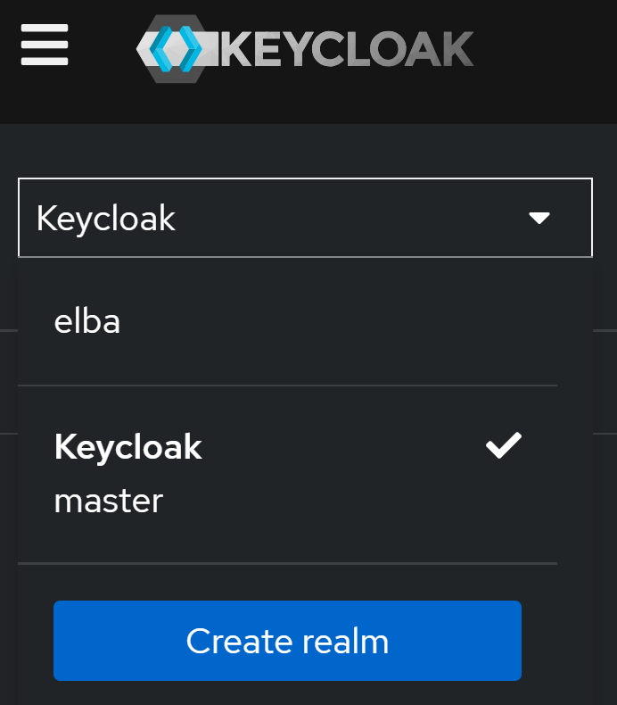
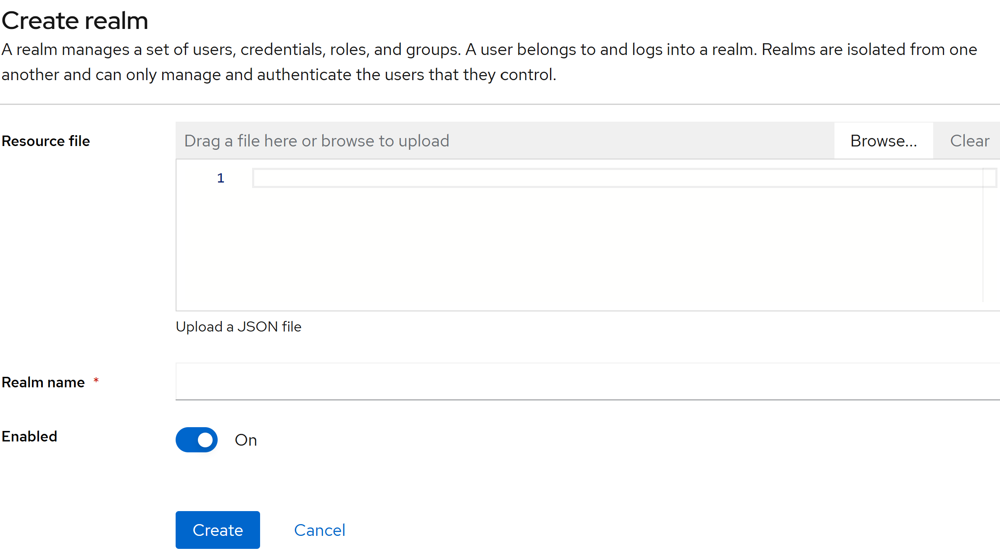

# Starter Pack - PostgresDB, Keycloak, Docker Compose

This starter pack is to help you setup a local development environment that has the following elements

1) A postgres DB running in Docker locally on your PC to serve as the DB for the API
2) A postgres DB running locally in Docker on your PC to serve as the DB for Keycloak
3) An example API implemented using Python FastAPI to show how Keycloak can be used to protect endpoints on the API and require authentication to access
4) The API also shows a few unit tests to test the functionality of the API which can be built upon further

## Setting up the local environment

### Install Docker

Install Docker on your computer if you do not have it already by following the instructions [here](https://docs.docker.com/engine/install/)

### Run Docker Compose

Save the below docker compose file and the corresponding .env file to a folder on your computer and run it using the command below

#### Commnd to run docker compose

```
    docker compose up -d  --abort-on-container-exit
```

#### Docker Compose

``` yaml
version: '3.8'

services:
  kc_postgres:
    image: postgres:latest
    env_file:
      - .env
    volumes:
      - elba_keycloak_postgres_data:/var/lib/postgresql/data
    environment:
      POSTGRES_DB: ${KC_POSTGRES_DB}
      POSTGRES_USER: ${KC_POSTGRES_USER}
      POSTGRES_PASSWORD: ${KC_POSTGRES_PASSWORD}
    ports:
      - "5432:5432"
    networks:
      - keycloak_network

  keycloak:
    image: quay.io/keycloak/keycloak:latest
    env_file:
      - .env
    command: start-dev
    environment:
      KC_HOSTNAME: localhost
      KC_HOSTNAME_PORT: 8080
      KC_HOSTNAME_STRICT_BACKCHANNEL: false
      KC_HTTP_ENABLED: true
      KC_HOSTNAME_STRICT_HTTPS: false
      KC_HEALTH_ENABLED: true
      KEYCLOAK_ADMIN: ${KEYCLOAK_ADMIN}
      KEYCLOAK_ADMIN_PASSWORD: ${KEYCLOAK_ADMIN_PASSWORD}
      KC_DB: postgres
      KC_DB_URL: jdbc:postgresql://kc_postgres:5432/${KC_POSTGRES_DB}
      KC_DB_USERNAME: ${KC_POSTGRES_USER}
      KC_DB_PASSWORD: ${KC_POSTGRES_PASSWORD}
    ports:
      - 8080:8080
    restart: always
    depends_on:
      - kc_postgres
    networks:
      - keycloak_network
      
  elba_postgres:
    image: postgres:latest # postgres:16.2
    env_file:
      - .env
    volumes:
      - elba_postgres_data:/var/lib/postgresql/data
    environment:
      POSTGRES_DB: ${POSTGRES_DB}
      POSTGRES_USER: ${POSTGRES_USER}
      POSTGRES_PASSWORD: ${POSTGRES_PASSWORD}
    ports:
      - "5433:5432"
    networks:
      - keycloak_network

volumes:
  elba_keycloak_postgres_data:
    driver: local
  elba_postgres_data:
    driver: local
  

networks:
  keycloak_network:
    driver: bridge

```

#### .env File

```
KC_POSTGRES_DB=keycloak_db
KC_POSTGRES_USER=keycloak_db_user
KC_POSTGRES_PASSWORD=keycloak_db_user_password
POSTGRES_DB=elba_db
POSTGRES_USER=elba_db_user
POSTGRES_PASSWORD=elba_db_password
KEYCLOAK_ADMIN=admin
KEYCLOAK_ADMIN_PASSWORD=password
```

### Run the sample Python FastAPI

#### Install Python

Install Python on your computer by following the instructions [here](https://www.python.org/downloads/)

#### Create a Python virtual environment

Create a folder on your computer for the API code, then browse to it on the command line and run the command below

Creating and activating a Python virtual environment using `venv` is a great way to manage dependencies for different projects. Here’s a step-by-step guide:

#### 1. Create a Virtual Environment

First, open your terminal or command prompt and navigate to your project directory. Then, run the following command:

```bash
python -m venv myenv
```

Replace `myenv` with the name you want for your virtual environment.

#### 2. Activate the Virtual Environment

The activation command varies depending on your operating system:

- **Windows (Command Prompt):**
  ```cmd
  myenv\Scripts\activate
  ```

- **Windows (PowerShell):**
  ```powershell
  .\myenv\Scripts\Activate
  ```

- **macOS/Linux (Bash):**
  ```bash
  source myenv/bin/activate
  ```

- **macOS/Linux (Fish):**
  ```fish
  source myenv/bin/activate.fish
  ```

#### 3. Deactivate the Virtual Environment

When you’re done working in the virtual environment, you can deactivate it by simply running:

```bash
deactivate
```

### Import Keycloak Realm

Save the below Keycloak Realm Export to a file on your computer named as **elba-realm-export.json**

``` json
{
  "id": "3b65750a-820e-4128-940e-cd2642c4101a",
  "realm": "elba",
  "notBefore": 0,
  "defaultSignatureAlgorithm": "RS256",
  "revokeRefreshToken": false,
  "refreshTokenMaxReuse": 0,
  "accessTokenLifespan": 300,
  "accessTokenLifespanForImplicitFlow": 900,
  "ssoSessionIdleTimeout": 1800,
  "ssoSessionMaxLifespan": 36000,
  "ssoSessionIdleTimeoutRememberMe": 0,
  "ssoSessionMaxLifespanRememberMe": 0,
  "offlineSessionIdleTimeout": 2592000,
  "offlineSessionMaxLifespanEnabled": false,
  "offlineSessionMaxLifespan": 5184000,
  "clientSessionIdleTimeout": 0,
  "clientSessionMaxLifespan": 0,
  "clientOfflineSessionIdleTimeout": 0,
  "clientOfflineSessionMaxLifespan": 0,
  "accessCodeLifespan": 60,
  "accessCodeLifespanUserAction": 300,
  "accessCodeLifespanLogin": 1800,
  "actionTokenGeneratedByAdminLifespan": 43200,
  "actionTokenGeneratedByUserLifespan": 300,
  "oauth2DeviceCodeLifespan": 600,
  "oauth2DevicePollingInterval": 5,
  "enabled": true,
  "sslRequired": "external",
  "registrationAllowed": false,
  "registrationEmailAsUsername": false,
  "rememberMe": false,
  "verifyEmail": false,
  "loginWithEmailAllowed": true,
  "duplicateEmailsAllowed": false,
  "resetPasswordAllowed": false,
  "editUsernameAllowed": false,
  "bruteForceProtected": false,
  "permanentLockout": false,
  "maxTemporaryLockouts": 0,
  "maxFailureWaitSeconds": 900,
  "minimumQuickLoginWaitSeconds": 60,
  "waitIncrementSeconds": 60,
  "quickLoginCheckMilliSeconds": 1000,
  "maxDeltaTimeSeconds": 43200,
  "failureFactor": 30,
  "roles": {
    "realm": [
      {
        "id": "1caf6df6-14ef-4804-a74a-506985154975",
        "name": "offline_access",
        "description": "${role_offline-access}",
        "composite": false,
        "clientRole": false,
        "containerId": "3b65750a-820e-4128-940e-cd2642c4101a",
        "attributes": {}
      },
      {
        "id": "0f36b2a5-1531-4b14-84ce-152abc2cba00",
        "name": "uma_authorization",
        "description": "${role_uma_authorization}",
        "composite": false,
        "clientRole": false,
        "containerId": "3b65750a-820e-4128-940e-cd2642c4101a",
        "attributes": {}
      },
      {
        "id": "2b1a4950-8892-4042-9316-cc50f738b98f",
        "name": "default-roles-elba",
        "description": "${role_default-roles}",
        "composite": true,
        "composites": {
          "realm": [
            "offline_access",
            "uma_authorization"
          ],
          "client": {
            "account": [
              "manage-account",
              "view-profile"
            ]
          }
        },
        "clientRole": false,
        "containerId": "3b65750a-820e-4128-940e-cd2642c4101a",
        "attributes": {}
      }
    ],
    "client": {
      "elbaapiswagger": [],
      "realm-management": [
        {
          "id": "67dbc267-6b30-4ecc-b15e-d72384cd3e39",
          "name": "realm-admin",
          "description": "${role_realm-admin}",
          "composite": true,
          "composites": {
            "client": {
              "realm-management": [
                "view-events",
                "view-identity-providers",
                "view-clients",
                "manage-realm",
                "query-realms",
                "manage-identity-providers",
                "view-users",
                "manage-events",
                "impersonation",
                "manage-authorization",
                "query-clients",
                "manage-users",
                "create-client",
                "query-users",
                "view-authorization",
                "query-groups",
                "view-realm",
                "manage-clients"
              ]
            }
          },
          "clientRole": true,
          "containerId": "191a83d3-17de-485c-8545-792d273fd837",
          "attributes": {}
        },
        {
          "id": "94e24eee-e7fc-452f-ac52-f10668393b8b",
          "name": "view-events",
          "description": "${role_view-events}",
          "composite": false,
          "clientRole": true,
          "containerId": "191a83d3-17de-485c-8545-792d273fd837",
          "attributes": {}
        },
        {
          "id": "0bdc2add-7fbb-49cc-a331-93b39d43588f",
          "name": "view-identity-providers",
          "description": "${role_view-identity-providers}",
          "composite": false,
          "clientRole": true,
          "containerId": "191a83d3-17de-485c-8545-792d273fd837",
          "attributes": {}
        },
        {
          "id": "62b9a337-c32d-42e5-bb1b-3ffe5da9b181",
          "name": "view-clients",
          "description": "${role_view-clients}",
          "composite": true,
          "composites": {
            "client": {
              "realm-management": [
                "query-clients"
              ]
            }
          },
          "clientRole": true,
          "containerId": "191a83d3-17de-485c-8545-792d273fd837",
          "attributes": {}
        },
        {
          "id": "35eb3b48-22f7-4a88-b33e-af79a7d1a59e",
          "name": "manage-realm",
          "description": "${role_manage-realm}",
          "composite": false,
          "clientRole": true,
          "containerId": "191a83d3-17de-485c-8545-792d273fd837",
          "attributes": {}
        },
        {
          "id": "a70e636a-a45f-4cdf-a6b2-4acbf4aaa775",
          "name": "query-realms",
          "description": "${role_query-realms}",
          "composite": false,
          "clientRole": true,
          "containerId": "191a83d3-17de-485c-8545-792d273fd837",
          "attributes": {}
        },
        {
          "id": "adca86b6-ea2b-4491-95e7-2b499f56977f",
          "name": "manage-identity-providers",
          "description": "${role_manage-identity-providers}",
          "composite": false,
          "clientRole": true,
          "containerId": "191a83d3-17de-485c-8545-792d273fd837",
          "attributes": {}
        },
        {
          "id": "c766ced0-cdf5-4d63-b476-1b23ce6a32a1",
          "name": "view-users",
          "description": "${role_view-users}",
          "composite": true,
          "composites": {
            "client": {
              "realm-management": [
                "query-users",
                "query-groups"
              ]
            }
          },
          "clientRole": true,
          "containerId": "191a83d3-17de-485c-8545-792d273fd837",
          "attributes": {}
        },
        {
          "id": "f9b51e24-c842-432b-8892-5d1577a0f4a2",
          "name": "manage-events",
          "description": "${role_manage-events}",
          "composite": false,
          "clientRole": true,
          "containerId": "191a83d3-17de-485c-8545-792d273fd837",
          "attributes": {}
        },
        {
          "id": "6baaa7da-95e0-41e5-ad26-28fc441962f4",
          "name": "impersonation",
          "description": "${role_impersonation}",
          "composite": false,
          "clientRole": true,
          "containerId": "191a83d3-17de-485c-8545-792d273fd837",
          "attributes": {}
        },
        {
          "id": "8f761275-8c0e-488d-8cc5-edb5f2c12b6c",
          "name": "manage-authorization",
          "description": "${role_manage-authorization}",
          "composite": false,
          "clientRole": true,
          "containerId": "191a83d3-17de-485c-8545-792d273fd837",
          "attributes": {}
        },
        {
          "id": "40d3cbcc-0eed-426b-9275-e6784f8af876",
          "name": "query-clients",
          "description": "${role_query-clients}",
          "composite": false,
          "clientRole": true,
          "containerId": "191a83d3-17de-485c-8545-792d273fd837",
          "attributes": {}
        },
        {
          "id": "86dc98e0-d8bd-4610-ab05-3f6aa242291f",
          "name": "manage-users",
          "description": "${role_manage-users}",
          "composite": false,
          "clientRole": true,
          "containerId": "191a83d3-17de-485c-8545-792d273fd837",
          "attributes": {}
        },
        {
          "id": "fa7a2ef2-67a5-43f5-93c5-3aed5a40b1df",
          "name": "create-client",
          "description": "${role_create-client}",
          "composite": false,
          "clientRole": true,
          "containerId": "191a83d3-17de-485c-8545-792d273fd837",
          "attributes": {}
        },
        {
          "id": "af620567-db71-4c8e-887a-5e39fe609eb8",
          "name": "query-users",
          "description": "${role_query-users}",
          "composite": false,
          "clientRole": true,
          "containerId": "191a83d3-17de-485c-8545-792d273fd837",
          "attributes": {}
        },
        {
          "id": "e143bc02-8e87-4350-b0a4-f70ab7b0d762",
          "name": "view-authorization",
          "description": "${role_view-authorization}",
          "composite": false,
          "clientRole": true,
          "containerId": "191a83d3-17de-485c-8545-792d273fd837",
          "attributes": {}
        },
        {
          "id": "a9ac5b57-50a0-48e2-af43-219c3380397a",
          "name": "query-groups",
          "description": "${role_query-groups}",
          "composite": false,
          "clientRole": true,
          "containerId": "191a83d3-17de-485c-8545-792d273fd837",
          "attributes": {}
        },
        {
          "id": "1528fc34-9317-4dd2-be4b-b36fa679bbc0",
          "name": "manage-clients",
          "description": "${role_manage-clients}",
          "composite": false,
          "clientRole": true,
          "containerId": "191a83d3-17de-485c-8545-792d273fd837",
          "attributes": {}
        },
        {
          "id": "5552f715-71a1-438d-8077-7968c828f6da",
          "name": "view-realm",
          "description": "${role_view-realm}",
          "composite": false,
          "clientRole": true,
          "containerId": "191a83d3-17de-485c-8545-792d273fd837",
          "attributes": {}
        }
      ],
      "security-admin-console": [],
      "elbaapi": [
        {
          "id": "a08ec2f1-2bfa-42da-9598-787af1407c8f",
          "name": "admin",
          "description": "admin",
          "composite": false,
          "clientRole": true,
          "containerId": "e8b8fc5d-0217-41a8-84bf-131ea8eee99e",
          "attributes": {}
        }
      ],
      "admin-cli": [],
      "account-console": [],
      "broker": [
        {
          "id": "9d5bd0d7-11db-4000-838b-92db19fb44c7",
          "name": "read-token",
          "description": "${role_read-token}",
          "composite": false,
          "clientRole": true,
          "containerId": "c6f658b7-7f1f-4c97-9271-7b164cc4660c",
          "attributes": {}
        }
      ],
      "account": [
        {
          "id": "f496900d-2d69-436a-a4d4-7689f6b1e480",
          "name": "manage-consent",
          "description": "${role_manage-consent}",
          "composite": true,
          "composites": {
            "client": {
              "account": [
                "view-consent"
              ]
            }
          },
          "clientRole": true,
          "containerId": "2003ef60-f68f-4fbe-91aa-8907ff083e18",
          "attributes": {}
        },
        {
          "id": "4f4e6201-9a44-4515-9568-e2f52ce8623a",
          "name": "view-applications",
          "description": "${role_view-applications}",
          "composite": false,
          "clientRole": true,
          "containerId": "2003ef60-f68f-4fbe-91aa-8907ff083e18",
          "attributes": {}
        },
        {
          "id": "fd48164a-f6e1-45f4-a225-267163b4497e",
          "name": "manage-account",
          "description": "${role_manage-account}",
          "composite": true,
          "composites": {
            "client": {
              "account": [
                "manage-account-links"
              ]
            }
          },
          "clientRole": true,
          "containerId": "2003ef60-f68f-4fbe-91aa-8907ff083e18",
          "attributes": {}
        },
        {
          "id": "a54c1c98-4548-4fbd-a6cd-0349297d8563",
          "name": "delete-account",
          "description": "${role_delete-account}",
          "composite": false,
          "clientRole": true,
          "containerId": "2003ef60-f68f-4fbe-91aa-8907ff083e18",
          "attributes": {}
        },
        {
          "id": "72580eb8-69e0-4399-b825-e1a7e2d7e0f8",
          "name": "view-consent",
          "description": "${role_view-consent}",
          "composite": false,
          "clientRole": true,
          "containerId": "2003ef60-f68f-4fbe-91aa-8907ff083e18",
          "attributes": {}
        },
        {
          "id": "41d1caa9-09c5-4639-b1cd-0ac63c189994",
          "name": "view-profile",
          "description": "${role_view-profile}",
          "composite": false,
          "clientRole": true,
          "containerId": "2003ef60-f68f-4fbe-91aa-8907ff083e18",
          "attributes": {}
        },
        {
          "id": "cde1def4-6f55-4352-a223-64982536b71d",
          "name": "view-groups",
          "description": "${role_view-groups}",
          "composite": false,
          "clientRole": true,
          "containerId": "2003ef60-f68f-4fbe-91aa-8907ff083e18",
          "attributes": {}
        },
        {
          "id": "814719ea-05c8-4e96-bd6f-bd1d1fa3c889",
          "name": "manage-account-links",
          "description": "${role_manage-account-links}",
          "composite": false,
          "clientRole": true,
          "containerId": "2003ef60-f68f-4fbe-91aa-8907ff083e18",
          "attributes": {}
        }
      ]
    }
  },
  "groups": [],
  "defaultRole": {
    "id": "2b1a4950-8892-4042-9316-cc50f738b98f",
    "name": "default-roles-elba",
    "description": "${role_default-roles}",
    "composite": true,
    "clientRole": false,
    "containerId": "3b65750a-820e-4128-940e-cd2642c4101a"
  },
  "requiredCredentials": [
    "password"
  ],
  "otpPolicyType": "totp",
  "otpPolicyAlgorithm": "HmacSHA1",
  "otpPolicyInitialCounter": 0,
  "otpPolicyDigits": 6,
  "otpPolicyLookAheadWindow": 1,
  "otpPolicyPeriod": 30,
  "otpPolicyCodeReusable": false,
  "otpSupportedApplications": [
    "totpAppFreeOTPName",
    "totpAppGoogleName",
    "totpAppMicrosoftAuthenticatorName"
  ],
  "localizationTexts": {},
  "webAuthnPolicyRpEntityName": "keycloak",
  "webAuthnPolicySignatureAlgorithms": [
    "ES256"
  ],
  "webAuthnPolicyRpId": "",
  "webAuthnPolicyAttestationConveyancePreference": "not specified",
  "webAuthnPolicyAuthenticatorAttachment": "not specified",
  "webAuthnPolicyRequireResidentKey": "not specified",
  "webAuthnPolicyUserVerificationRequirement": "not specified",
  "webAuthnPolicyCreateTimeout": 0,
  "webAuthnPolicyAvoidSameAuthenticatorRegister": false,
  "webAuthnPolicyAcceptableAaguids": [],
  "webAuthnPolicyExtraOrigins": [],
  "webAuthnPolicyPasswordlessRpEntityName": "keycloak",
  "webAuthnPolicyPasswordlessSignatureAlgorithms": [
    "ES256"
  ],
  "webAuthnPolicyPasswordlessRpId": "",
  "webAuthnPolicyPasswordlessAttestationConveyancePreference": "not specified",
  "webAuthnPolicyPasswordlessAuthenticatorAttachment": "not specified",
  "webAuthnPolicyPasswordlessRequireResidentKey": "not specified",
  "webAuthnPolicyPasswordlessUserVerificationRequirement": "not specified",
  "webAuthnPolicyPasswordlessCreateTimeout": 0,
  "webAuthnPolicyPasswordlessAvoidSameAuthenticatorRegister": false,
  "webAuthnPolicyPasswordlessAcceptableAaguids": [],
  "webAuthnPolicyPasswordlessExtraOrigins": [],
  "scopeMappings": [
    {
      "clientScope": "offline_access",
      "roles": [
        "offline_access"
      ]
    }
  ],
  "clientScopeMappings": {
    "account": [
      {
        "client": "account-console",
        "roles": [
          "manage-account",
          "view-groups"
        ]
      }
    ]
  },
  "clients": [
    {
      "id": "2003ef60-f68f-4fbe-91aa-8907ff083e18",
      "clientId": "account",
      "name": "${client_account}",
      "rootUrl": "${authBaseUrl}",
      "baseUrl": "/realms/elba/account/",
      "surrogateAuthRequired": false,
      "enabled": true,
      "alwaysDisplayInConsole": false,
      "clientAuthenticatorType": "client-secret",
      "redirectUris": [
        "/realms/elba/account/*"
      ],
      "webOrigins": [],
      "notBefore": 0,
      "bearerOnly": false,
      "consentRequired": false,
      "standardFlowEnabled": true,
      "implicitFlowEnabled": false,
      "directAccessGrantsEnabled": false,
      "serviceAccountsEnabled": false,
      "publicClient": true,
      "frontchannelLogout": false,
      "protocol": "openid-connect",
      "attributes": {
        "post.logout.redirect.uris": "+"
      },
      "authenticationFlowBindingOverrides": {},
      "fullScopeAllowed": false,
      "nodeReRegistrationTimeout": 0,
      "defaultClientScopes": [
        "web-origins",
        "acr",
        "profile",
        "roles",
        "basic",
        "email"
      ],
      "optionalClientScopes": [
        "address",
        "phone",
        "offline_access",
        "microprofile-jwt"
      ]
    },
    {
      "id": "e480f308-3439-4221-a4ef-f82fcdcc1dd7",
      "clientId": "account-console",
      "name": "${client_account-console}",
      "rootUrl": "${authBaseUrl}",
      "baseUrl": "/realms/elba/account/",
      "surrogateAuthRequired": false,
      "enabled": true,
      "alwaysDisplayInConsole": false,
      "clientAuthenticatorType": "client-secret",
      "redirectUris": [
        "/realms/elba/account/*"
      ],
      "webOrigins": [],
      "notBefore": 0,
      "bearerOnly": false,
      "consentRequired": false,
      "standardFlowEnabled": true,
      "implicitFlowEnabled": false,
      "directAccessGrantsEnabled": false,
      "serviceAccountsEnabled": false,
      "publicClient": true,
      "frontchannelLogout": false,
      "protocol": "openid-connect",
      "attributes": {
        "post.logout.redirect.uris": "+",
        "pkce.code.challenge.method": "S256"
      },
      "authenticationFlowBindingOverrides": {},
      "fullScopeAllowed": false,
      "nodeReRegistrationTimeout": 0,
      "protocolMappers": [
        {
          "id": "e9a67fe7-972f-4f20-b0f1-190ffb686d5d",
          "name": "audience resolve",
          "protocol": "openid-connect",
          "protocolMapper": "oidc-audience-resolve-mapper",
          "consentRequired": false,
          "config": {}
        }
      ],
      "defaultClientScopes": [
        "web-origins",
        "acr",
        "profile",
        "roles",
        "basic",
        "email"
      ],
      "optionalClientScopes": [
        "address",
        "phone",
        "offline_access",
        "microprofile-jwt"
      ]
    },
    {
      "id": "391d9fdf-1dcc-4a9f-b33e-fbb3532567fc",
      "clientId": "admin-cli",
      "name": "${client_admin-cli}",
      "surrogateAuthRequired": false,
      "enabled": true,
      "alwaysDisplayInConsole": false,
      "clientAuthenticatorType": "client-secret",
      "redirectUris": [],
      "webOrigins": [],
      "notBefore": 0,
      "bearerOnly": false,
      "consentRequired": false,
      "standardFlowEnabled": false,
      "implicitFlowEnabled": false,
      "directAccessGrantsEnabled": true,
      "serviceAccountsEnabled": false,
      "publicClient": true,
      "frontchannelLogout": false,
      "protocol": "openid-connect",
      "attributes": {},
      "authenticationFlowBindingOverrides": {},
      "fullScopeAllowed": false,
      "nodeReRegistrationTimeout": 0,
      "defaultClientScopes": [
        "web-origins",
        "acr",
        "profile",
        "roles",
        "basic",
        "email"
      ],
      "optionalClientScopes": [
        "address",
        "phone",
        "offline_access",
        "microprofile-jwt"
      ]
    },
    {
      "id": "c6f658b7-7f1f-4c97-9271-7b164cc4660c",
      "clientId": "broker",
      "name": "${client_broker}",
      "surrogateAuthRequired": false,
      "enabled": true,
      "alwaysDisplayInConsole": false,
      "clientAuthenticatorType": "client-secret",
      "redirectUris": [],
      "webOrigins": [],
      "notBefore": 0,
      "bearerOnly": true,
      "consentRequired": false,
      "standardFlowEnabled": true,
      "implicitFlowEnabled": false,
      "directAccessGrantsEnabled": false,
      "serviceAccountsEnabled": false,
      "publicClient": false,
      "frontchannelLogout": false,
      "protocol": "openid-connect",
      "attributes": {},
      "authenticationFlowBindingOverrides": {},
      "fullScopeAllowed": false,
      "nodeReRegistrationTimeout": 0,
      "defaultClientScopes": [
        "web-origins",
        "acr",
        "profile",
        "roles",
        "basic",
        "email"
      ],
      "optionalClientScopes": [
        "address",
        "phone",
        "offline_access",
        "microprofile-jwt"
      ]
    },
    {
      "id": "e8b8fc5d-0217-41a8-84bf-131ea8eee99e",
      "clientId": "elbaapi",
      "name": "Elba Api",
      "description": "Elba Api",
      "rootUrl": "http://localhost:8000",
      "adminUrl": "http://localhost:8000",
      "baseUrl": "http://localhost:8000",
      "surrogateAuthRequired": false,
      "enabled": true,
      "alwaysDisplayInConsole": false,
      "clientAuthenticatorType": "client-secret",
      "redirectUris": [
        "http://localhost:8000/*"
      ],
      "webOrigins": [
        "http://localhost:8000"
      ],
      "notBefore": 0,
      "bearerOnly": false,
      "consentRequired": false,
      "standardFlowEnabled": true,
      "implicitFlowEnabled": false,
      "directAccessGrantsEnabled": false,
      "serviceAccountsEnabled": false,
      "publicClient": true,
      "frontchannelLogout": true,
      "protocol": "openid-connect",
      "attributes": {
        "oidc.ciba.grant.enabled": "false",
        "backchannel.logout.session.required": "true",
        "post.logout.redirect.uris": "http://localhost:8000/*",
        "oauth2.device.authorization.grant.enabled": "false",
        "backchannel.logout.revoke.offline.tokens": "false"
      },
      "authenticationFlowBindingOverrides": {},
      "fullScopeAllowed": true,
      "nodeReRegistrationTimeout": -1,
      "protocolMappers": [
        {
          "id": "291182ea-acad-4303-aab5-525bb1851881",
          "name": "audience-mapper",
          "protocol": "openid-connect",
          "protocolMapper": "oidc-audience-mapper",
          "consentRequired": false,
          "config": {
            "included.client.audience": "elbaapi",
            "id.token.claim": "true",
            "lightweight.claim": "false",
            "access.token.claim": "true",
            "introspection.token.claim": "true"
          }
        }
      ],
      "defaultClientScopes": [
        "web-origins",
        "acr",
        "profile",
        "roles",
        "basic",
        "email"
      ],
      "optionalClientScopes": [
        "address",
        "phone",
        "offline_access",
        "microprofile-jwt"
      ]
    },
    {
      "id": "9b5ef642-dbeb-488c-a85b-da0c37c8de53",
      "clientId": "elbaapiswagger",
      "name": "elbaapiswagger",
      "description": "elba api swagger",
      "rootUrl": "http://localhost:8000",
      "adminUrl": "http://localhost:8000",
      "baseUrl": "http://localhost:8000",
      "surrogateAuthRequired": false,
      "enabled": true,
      "alwaysDisplayInConsole": false,
      "clientAuthenticatorType": "client-secret",
      "redirectUris": [
        "http://localhost:8000/*"
      ],
      "webOrigins": [
        "http://localhost:8000"
      ],
      "notBefore": 0,
      "bearerOnly": false,
      "consentRequired": false,
      "standardFlowEnabled": true,
      "implicitFlowEnabled": false,
      "directAccessGrantsEnabled": false,
      "serviceAccountsEnabled": false,
      "publicClient": true,
      "frontchannelLogout": true,
      "protocol": "openid-connect",
      "attributes": {
        "oidc.ciba.grant.enabled": "false",
        "backchannel.logout.session.required": "true",
        "post.logout.redirect.uris": "http://localhost:8000/*",
        "oauth2.device.authorization.grant.enabled": "false",
        "backchannel.logout.revoke.offline.tokens": "false"
      },
      "authenticationFlowBindingOverrides": {},
      "fullScopeAllowed": true,
      "nodeReRegistrationTimeout": -1,
      "defaultClientScopes": [
        "web-origins",
        "acr",
        "profile",
        "roles",
        "basic",
        "email"
      ],
      "optionalClientScopes": [
        "address",
        "phone",
        "offline_access",
        "microprofile-jwt"
      ]
    },
    {
      "id": "191a83d3-17de-485c-8545-792d273fd837",
      "clientId": "realm-management",
      "name": "${client_realm-management}",
      "surrogateAuthRequired": false,
      "enabled": true,
      "alwaysDisplayInConsole": false,
      "clientAuthenticatorType": "client-secret",
      "redirectUris": [],
      "webOrigins": [],
      "notBefore": 0,
      "bearerOnly": true,
      "consentRequired": false,
      "standardFlowEnabled": true,
      "implicitFlowEnabled": false,
      "directAccessGrantsEnabled": false,
      "serviceAccountsEnabled": false,
      "publicClient": false,
      "frontchannelLogout": false,
      "protocol": "openid-connect",
      "attributes": {},
      "authenticationFlowBindingOverrides": {},
      "fullScopeAllowed": false,
      "nodeReRegistrationTimeout": 0,
      "defaultClientScopes": [
        "web-origins",
        "acr",
        "profile",
        "roles",
        "basic",
        "email"
      ],
      "optionalClientScopes": [
        "address",
        "phone",
        "offline_access",
        "microprofile-jwt"
      ]
    },
    {
      "id": "b993b0a3-cdf2-4cb7-9920-f6c575e93f2d",
      "clientId": "security-admin-console",
      "name": "${client_security-admin-console}",
      "rootUrl": "${authAdminUrl}",
      "baseUrl": "/admin/elba/console/",
      "surrogateAuthRequired": false,
      "enabled": true,
      "alwaysDisplayInConsole": false,
      "clientAuthenticatorType": "client-secret",
      "redirectUris": [
        "/admin/elba/console/*"
      ],
      "webOrigins": [
        "+"
      ],
      "notBefore": 0,
      "bearerOnly": false,
      "consentRequired": false,
      "standardFlowEnabled": true,
      "implicitFlowEnabled": false,
      "directAccessGrantsEnabled": false,
      "serviceAccountsEnabled": false,
      "publicClient": true,
      "frontchannelLogout": false,
      "protocol": "openid-connect",
      "attributes": {
        "post.logout.redirect.uris": "+",
        "pkce.code.challenge.method": "S256"
      },
      "authenticationFlowBindingOverrides": {},
      "fullScopeAllowed": false,
      "nodeReRegistrationTimeout": 0,
      "protocolMappers": [
        {
          "id": "638a66f9-56ff-4a3c-87fe-064c35b317ee",
          "name": "locale",
          "protocol": "openid-connect",
          "protocolMapper": "oidc-usermodel-attribute-mapper",
          "consentRequired": false,
          "config": {
            "introspection.token.claim": "true",
            "userinfo.token.claim": "true",
            "user.attribute": "locale",
            "id.token.claim": "true",
            "access.token.claim": "true",
            "claim.name": "locale",
            "jsonType.label": "String"
          }
        }
      ],
      "defaultClientScopes": [
        "web-origins",
        "acr",
        "profile",
        "roles",
        "basic",
        "email"
      ],
      "optionalClientScopes": [
        "address",
        "phone",
        "offline_access",
        "microprofile-jwt"
      ]
    }
  ],
  "clientScopes": [
    {
      "id": "8b23489e-bcda-4206-89ac-a178c18ae76b",
      "name": "address",
      "description": "OpenID Connect built-in scope: address",
      "protocol": "openid-connect",
      "attributes": {
        "include.in.token.scope": "true",
        "consent.screen.text": "${addressScopeConsentText}",
        "display.on.consent.screen": "true"
      },
      "protocolMappers": [
        {
          "id": "6e1f6c06-7f16-432e-a806-5331643b80cf",
          "name": "address",
          "protocol": "openid-connect",
          "protocolMapper": "oidc-address-mapper",
          "consentRequired": false,
          "config": {
            "user.attribute.formatted": "formatted",
            "user.attribute.country": "country",
            "introspection.token.claim": "true",
            "user.attribute.postal_code": "postal_code",
            "userinfo.token.claim": "true",
            "user.attribute.street": "street",
            "id.token.claim": "true",
            "user.attribute.region": "region",
            "access.token.claim": "true",
            "user.attribute.locality": "locality"
          }
        }
      ]
    },
    {
      "id": "f001759f-bec4-497b-bad8-fd3f1029aef5",
      "name": "acr",
      "description": "OpenID Connect scope for add acr (authentication context class reference) to the token",
      "protocol": "openid-connect",
      "attributes": {
        "include.in.token.scope": "false",
        "display.on.consent.screen": "false"
      },
      "protocolMappers": [
        {
          "id": "bc38d608-de52-42d9-9f7e-0596989032d8",
          "name": "acr loa level",
          "protocol": "openid-connect",
          "protocolMapper": "oidc-acr-mapper",
          "consentRequired": false,
          "config": {
            "id.token.claim": "true",
            "introspection.token.claim": "true",
            "access.token.claim": "true"
          }
        }
      ]
    },
    {
      "id": "83bd01aa-85b3-4dd8-b562-345fb4797311",
      "name": "microprofile-jwt",
      "description": "Microprofile - JWT built-in scope",
      "protocol": "openid-connect",
      "attributes": {
        "include.in.token.scope": "true",
        "display.on.consent.screen": "false"
      },
      "protocolMappers": [
        {
          "id": "74c29317-4cab-4ba3-a4d7-23314ee4d111",
          "name": "upn",
          "protocol": "openid-connect",
          "protocolMapper": "oidc-usermodel-attribute-mapper",
          "consentRequired": false,
          "config": {
            "introspection.token.claim": "true",
            "userinfo.token.claim": "true",
            "user.attribute": "username",
            "id.token.claim": "true",
            "access.token.claim": "true",
            "claim.name": "upn",
            "jsonType.label": "String"
          }
        },
        {
          "id": "7a67c5b7-a657-42c6-847f-b593e713c1e2",
          "name": "groups",
          "protocol": "openid-connect",
          "protocolMapper": "oidc-usermodel-realm-role-mapper",
          "consentRequired": false,
          "config": {
            "introspection.token.claim": "true",
            "multivalued": "true",
            "user.attribute": "foo",
            "id.token.claim": "true",
            "access.token.claim": "true",
            "claim.name": "groups",
            "jsonType.label": "String"
          }
        }
      ]
    },
    {
      "id": "d1f2b1b0-aef1-4439-96ba-1bbcea8ba735",
      "name": "email",
      "description": "OpenID Connect built-in scope: email",
      "protocol": "openid-connect",
      "attributes": {
        "include.in.token.scope": "true",
        "consent.screen.text": "${emailScopeConsentText}",
        "display.on.consent.screen": "true"
      },
      "protocolMappers": [
        {
          "id": "42400f7f-a823-48ec-ab5d-c2970bee318c",
          "name": "email",
          "protocol": "openid-connect",
          "protocolMapper": "oidc-usermodel-attribute-mapper",
          "consentRequired": false,
          "config": {
            "introspection.token.claim": "true",
            "userinfo.token.claim": "true",
            "user.attribute": "email",
            "id.token.claim": "true",
            "access.token.claim": "true",
            "claim.name": "email",
            "jsonType.label": "String"
          }
        },
        {
          "id": "a1e6fc3d-0187-4fab-b5da-d80140a1dca9",
          "name": "email verified",
          "protocol": "openid-connect",
          "protocolMapper": "oidc-usermodel-property-mapper",
          "consentRequired": false,
          "config": {
            "introspection.token.claim": "true",
            "userinfo.token.claim": "true",
            "user.attribute": "emailVerified",
            "id.token.claim": "true",
            "access.token.claim": "true",
            "claim.name": "email_verified",
            "jsonType.label": "boolean"
          }
        }
      ]
    },
    {
      "id": "92f58757-34f0-4374-bdb9-3240661d157c",
      "name": "web-origins",
      "description": "OpenID Connect scope for add allowed web origins to the access token",
      "protocol": "openid-connect",
      "attributes": {
        "include.in.token.scope": "false",
        "consent.screen.text": "",
        "display.on.consent.screen": "false"
      },
      "protocolMappers": [
        {
          "id": "4a6640a5-cc08-4f01-87b4-484d4df8f434",
          "name": "allowed web origins",
          "protocol": "openid-connect",
          "protocolMapper": "oidc-allowed-origins-mapper",
          "consentRequired": false,
          "config": {
            "introspection.token.claim": "true",
            "access.token.claim": "true"
          }
        }
      ]
    },
    {
      "id": "65a75f90-f825-4667-a9f4-62c5f19aaac8",
      "name": "profile",
      "description": "OpenID Connect built-in scope: profile",
      "protocol": "openid-connect",
      "attributes": {
        "include.in.token.scope": "true",
        "consent.screen.text": "${profileScopeConsentText}",
        "display.on.consent.screen": "true"
      },
      "protocolMappers": [
        {
          "id": "332b03d8-5681-4f07-ab15-9c47ac6d528e",
          "name": "username",
          "protocol": "openid-connect",
          "protocolMapper": "oidc-usermodel-attribute-mapper",
          "consentRequired": false,
          "config": {
            "introspection.token.claim": "true",
            "userinfo.token.claim": "true",
            "user.attribute": "username",
            "id.token.claim": "true",
            "access.token.claim": "true",
            "claim.name": "preferred_username",
            "jsonType.label": "String"
          }
        },
        {
          "id": "c1caf9cc-3563-4d2f-8b42-baaa82c5bb96",
          "name": "middle name",
          "protocol": "openid-connect",
          "protocolMapper": "oidc-usermodel-attribute-mapper",
          "consentRequired": false,
          "config": {
            "introspection.token.claim": "true",
            "userinfo.token.claim": "true",
            "user.attribute": "middleName",
            "id.token.claim": "true",
            "access.token.claim": "true",
            "claim.name": "middle_name",
            "jsonType.label": "String"
          }
        },
        {
          "id": "d49e2e12-69b6-4bd5-8fd9-a3eab7117ef8",
          "name": "full name",
          "protocol": "openid-connect",
          "protocolMapper": "oidc-full-name-mapper",
          "consentRequired": false,
          "config": {
            "id.token.claim": "true",
            "introspection.token.claim": "true",
            "access.token.claim": "true",
            "userinfo.token.claim": "true"
          }
        },
        {
          "id": "8ac623ed-209f-40a0-a5a8-f5f1bb59f89f",
          "name": "profile",
          "protocol": "openid-connect",
          "protocolMapper": "oidc-usermodel-attribute-mapper",
          "consentRequired": false,
          "config": {
            "introspection.token.claim": "true",
            "userinfo.token.claim": "true",
            "user.attribute": "profile",
            "id.token.claim": "true",
            "access.token.claim": "true",
            "claim.name": "profile",
            "jsonType.label": "String"
          }
        },
        {
          "id": "0789ff8d-20be-45a9-baf1-3bd610bc79ca",
          "name": "gender",
          "protocol": "openid-connect",
          "protocolMapper": "oidc-usermodel-attribute-mapper",
          "consentRequired": false,
          "config": {
            "introspection.token.claim": "true",
            "userinfo.token.claim": "true",
            "user.attribute": "gender",
            "id.token.claim": "true",
            "access.token.claim": "true",
            "claim.name": "gender",
            "jsonType.label": "String"
          }
        },
        {
          "id": "e7da4927-fd81-4460-86e8-cff5eaa1fd71",
          "name": "updated at",
          "protocol": "openid-connect",
          "protocolMapper": "oidc-usermodel-attribute-mapper",
          "consentRequired": false,
          "config": {
            "introspection.token.claim": "true",
            "userinfo.token.claim": "true",
            "user.attribute": "updatedAt",
            "id.token.claim": "true",
            "access.token.claim": "true",
            "claim.name": "updated_at",
            "jsonType.label": "long"
          }
        },
        {
          "id": "f0c210c4-4210-4819-be56-8bc60d80665e",
          "name": "locale",
          "protocol": "openid-connect",
          "protocolMapper": "oidc-usermodel-attribute-mapper",
          "consentRequired": false,
          "config": {
            "introspection.token.claim": "true",
            "userinfo.token.claim": "true",
            "user.attribute": "locale",
            "id.token.claim": "true",
            "access.token.claim": "true",
            "claim.name": "locale",
            "jsonType.label": "String"
          }
        },
        {
          "id": "4773a8f0-f16c-49cd-b262-2e73fba0c85a",
          "name": "family name",
          "protocol": "openid-connect",
          "protocolMapper": "oidc-usermodel-attribute-mapper",
          "consentRequired": false,
          "config": {
            "introspection.token.claim": "true",
            "userinfo.token.claim": "true",
            "user.attribute": "lastName",
            "id.token.claim": "true",
            "access.token.claim": "true",
            "claim.name": "family_name",
            "jsonType.label": "String"
          }
        },
        {
          "id": "d40183c3-93a5-4445-8cdf-ec2724a68053",
          "name": "picture",
          "protocol": "openid-connect",
          "protocolMapper": "oidc-usermodel-attribute-mapper",
          "consentRequired": false,
          "config": {
            "introspection.token.claim": "true",
            "userinfo.token.claim": "true",
            "user.attribute": "picture",
            "id.token.claim": "true",
            "access.token.claim": "true",
            "claim.name": "picture",
            "jsonType.label": "String"
          }
        },
        {
          "id": "57ce20dc-3704-433a-9aa7-ebfe497cc61f",
          "name": "zoneinfo",
          "protocol": "openid-connect",
          "protocolMapper": "oidc-usermodel-attribute-mapper",
          "consentRequired": false,
          "config": {
            "introspection.token.claim": "true",
            "userinfo.token.claim": "true",
            "user.attribute": "zoneinfo",
            "id.token.claim": "true",
            "access.token.claim": "true",
            "claim.name": "zoneinfo",
            "jsonType.label": "String"
          }
        },
        {
          "id": "17fb8912-e0ff-4943-a6cd-1ad9c23f6da2",
          "name": "birthdate",
          "protocol": "openid-connect",
          "protocolMapper": "oidc-usermodel-attribute-mapper",
          "consentRequired": false,
          "config": {
            "introspection.token.claim": "true",
            "userinfo.token.claim": "true",
            "user.attribute": "birthdate",
            "id.token.claim": "true",
            "access.token.claim": "true",
            "claim.name": "birthdate",
            "jsonType.label": "String"
          }
        },
        {
          "id": "63455b1a-e110-4643-824f-e5d2b34ccf3a",
          "name": "given name",
          "protocol": "openid-connect",
          "protocolMapper": "oidc-usermodel-attribute-mapper",
          "consentRequired": false,
          "config": {
            "introspection.token.claim": "true",
            "userinfo.token.claim": "true",
            "user.attribute": "firstName",
            "id.token.claim": "true",
            "access.token.claim": "true",
            "claim.name": "given_name",
            "jsonType.label": "String"
          }
        },
        {
          "id": "c474e907-76e6-4cdd-b48a-b56986a8dbbf",
          "name": "nickname",
          "protocol": "openid-connect",
          "protocolMapper": "oidc-usermodel-attribute-mapper",
          "consentRequired": false,
          "config": {
            "introspection.token.claim": "true",
            "userinfo.token.claim": "true",
            "user.attribute": "nickname",
            "id.token.claim": "true",
            "access.token.claim": "true",
            "claim.name": "nickname",
            "jsonType.label": "String"
          }
        },
        {
          "id": "2e5cea4a-ba21-4e13-8f97-b00d39c6de4b",
          "name": "website",
          "protocol": "openid-connect",
          "protocolMapper": "oidc-usermodel-attribute-mapper",
          "consentRequired": false,
          "config": {
            "introspection.token.claim": "true",
            "userinfo.token.claim": "true",
            "user.attribute": "website",
            "id.token.claim": "true",
            "access.token.claim": "true",
            "claim.name": "website",
            "jsonType.label": "String"
          }
        }
      ]
    },
    {
      "id": "ad588bd3-8127-4b7d-8824-30ff9cc5d951",
      "name": "phone",
      "description": "OpenID Connect built-in scope: phone",
      "protocol": "openid-connect",
      "attributes": {
        "include.in.token.scope": "true",
        "consent.screen.text": "${phoneScopeConsentText}",
        "display.on.consent.screen": "true"
      },
      "protocolMappers": [
        {
          "id": "786e716d-9860-4208-88cb-0dc6efd8e77f",
          "name": "phone number",
          "protocol": "openid-connect",
          "protocolMapper": "oidc-usermodel-attribute-mapper",
          "consentRequired": false,
          "config": {
            "introspection.token.claim": "true",
            "userinfo.token.claim": "true",
            "user.attribute": "phoneNumber",
            "id.token.claim": "true",
            "access.token.claim": "true",
            "claim.name": "phone_number",
            "jsonType.label": "String"
          }
        },
        {
          "id": "e1be9583-a4ed-427a-806b-842ef6383844",
          "name": "phone number verified",
          "protocol": "openid-connect",
          "protocolMapper": "oidc-usermodel-attribute-mapper",
          "consentRequired": false,
          "config": {
            "introspection.token.claim": "true",
            "userinfo.token.claim": "true",
            "user.attribute": "phoneNumberVerified",
            "id.token.claim": "true",
            "access.token.claim": "true",
            "claim.name": "phone_number_verified",
            "jsonType.label": "boolean"
          }
        }
      ]
    },
    {
      "id": "09c86dd4-f766-484d-aa4e-957d321c7cd5",
      "name": "roles",
      "description": "OpenID Connect scope for add user roles to the access token",
      "protocol": "openid-connect",
      "attributes": {
        "include.in.token.scope": "false",
        "consent.screen.text": "${rolesScopeConsentText}",
        "display.on.consent.screen": "true"
      },
      "protocolMappers": [
        {
          "id": "ee40450c-fbfb-4bb8-b4b8-b5ea1a97342d",
          "name": "realm roles",
          "protocol": "openid-connect",
          "protocolMapper": "oidc-usermodel-realm-role-mapper",
          "consentRequired": false,
          "config": {
            "user.attribute": "foo",
            "introspection.token.claim": "true",
            "access.token.claim": "true",
            "claim.name": "realm_access.roles",
            "jsonType.label": "String",
            "multivalued": "true"
          }
        },
        {
          "id": "03d05d49-1adc-41d0-a558-96136c826b3f",
          "name": "client roles",
          "protocol": "openid-connect",
          "protocolMapper": "oidc-usermodel-client-role-mapper",
          "consentRequired": false,
          "config": {
            "user.attribute": "foo",
            "introspection.token.claim": "true",
            "access.token.claim": "true",
            "claim.name": "resource_access.${client_id}.roles",
            "jsonType.label": "String",
            "multivalued": "true"
          }
        },
        {
          "id": "91ec95c5-1e07-4ebf-9bb7-8414cd57c1f1",
          "name": "audience resolve",
          "protocol": "openid-connect",
          "protocolMapper": "oidc-audience-resolve-mapper",
          "consentRequired": false,
          "config": {
            "introspection.token.claim": "true",
            "access.token.claim": "true"
          }
        }
      ]
    },
    {
      "id": "ad3bbbcb-c53f-4d1b-9096-592f988d0c64",
      "name": "basic",
      "description": "OpenID Connect scope for add all basic claims to the token",
      "protocol": "openid-connect",
      "attributes": {
        "include.in.token.scope": "false",
        "display.on.consent.screen": "false"
      },
      "protocolMappers": [
        {
          "id": "86ee6450-757f-4bcb-a999-8613d6f938a6",
          "name": "sub",
          "protocol": "openid-connect",
          "protocolMapper": "oidc-sub-mapper",
          "consentRequired": false,
          "config": {
            "introspection.token.claim": "true",
            "access.token.claim": "true"
          }
        },
        {
          "id": "f14ecbf0-2a93-4c7c-9600-4b9ea195973c",
          "name": "auth_time",
          "protocol": "openid-connect",
          "protocolMapper": "oidc-usersessionmodel-note-mapper",
          "consentRequired": false,
          "config": {
            "user.session.note": "AUTH_TIME",
            "id.token.claim": "true",
            "introspection.token.claim": "true",
            "access.token.claim": "true",
            "claim.name": "auth_time",
            "jsonType.label": "long"
          }
        }
      ]
    },
    {
      "id": "b21b59dc-2aaf-4847-b4b1-45112e2c5486",
      "name": "offline_access",
      "description": "OpenID Connect built-in scope: offline_access",
      "protocol": "openid-connect",
      "attributes": {
        "consent.screen.text": "${offlineAccessScopeConsentText}",
        "display.on.consent.screen": "true"
      }
    },
    {
      "id": "b86cbc1d-5e27-4aef-bc85-280a6e3ca020",
      "name": "role_list",
      "description": "SAML role list",
      "protocol": "saml",
      "attributes": {
        "consent.screen.text": "${samlRoleListScopeConsentText}",
        "display.on.consent.screen": "true"
      },
      "protocolMappers": [
        {
          "id": "c432e7a7-b88f-48ef-ac75-144b778d335f",
          "name": "role list",
          "protocol": "saml",
          "protocolMapper": "saml-role-list-mapper",
          "consentRequired": false,
          "config": {
            "single": "false",
            "attribute.nameformat": "Basic",
            "attribute.name": "Role"
          }
        }
      ]
    }
  ],
  "defaultDefaultClientScopes": [
    "role_list",
    "profile",
    "email",
    "roles",
    "web-origins",
    "acr",
    "basic"
  ],
  "defaultOptionalClientScopes": [
    "offline_access",
    "address",
    "phone",
    "microprofile-jwt"
  ],
  "browserSecurityHeaders": {
    "contentSecurityPolicyReportOnly": "",
    "xContentTypeOptions": "nosniff",
    "referrerPolicy": "no-referrer",
    "xRobotsTag": "none",
    "xFrameOptions": "SAMEORIGIN",
    "contentSecurityPolicy": "frame-src 'self'; frame-ancestors 'self'; object-src 'none';",
    "xXSSProtection": "1; mode=block",
    "strictTransportSecurity": "max-age=31536000; includeSubDomains"
  },
  "smtpServer": {},
  "eventsEnabled": false,
  "eventsListeners": [
    "jboss-logging"
  ],
  "enabledEventTypes": [],
  "adminEventsEnabled": false,
  "adminEventsDetailsEnabled": false,
  "identityProviders": [],
  "identityProviderMappers": [],
  "components": {
    "org.keycloak.services.clientregistration.policy.ClientRegistrationPolicy": [
      {
        "id": "ad6b6a43-c53e-4310-9312-4318e43b83e3",
        "name": "Max Clients Limit",
        "providerId": "max-clients",
        "subType": "anonymous",
        "subComponents": {},
        "config": {
          "max-clients": [
            "200"
          ]
        }
      },
      {
        "id": "e050478a-fb15-4438-b155-e8376285fb93",
        "name": "Allowed Client Scopes",
        "providerId": "allowed-client-templates",
        "subType": "authenticated",
        "subComponents": {},
        "config": {
          "allow-default-scopes": [
            "true"
          ]
        }
      },
      {
        "id": "bebfc58d-6406-4a39-a35c-ac2b6ad11bd6",
        "name": "Trusted Hosts",
        "providerId": "trusted-hosts",
        "subType": "anonymous",
        "subComponents": {},
        "config": {
          "host-sending-registration-request-must-match": [
            "true"
          ],
          "client-uris-must-match": [
            "true"
          ]
        }
      },
      {
        "id": "a3adee40-3394-44b2-a2be-e49b6f23f1e6",
        "name": "Allowed Client Scopes",
        "providerId": "allowed-client-templates",
        "subType": "anonymous",
        "subComponents": {},
        "config": {
          "allow-default-scopes": [
            "true"
          ]
        }
      },
      {
        "id": "0b4e5922-0fa4-4c5b-9b28-012c080c11d1",
        "name": "Full Scope Disabled",
        "providerId": "scope",
        "subType": "anonymous",
        "subComponents": {},
        "config": {}
      },
      {
        "id": "0eb4f790-6d52-4e95-83f1-565808aece57",
        "name": "Allowed Protocol Mapper Types",
        "providerId": "allowed-protocol-mappers",
        "subType": "anonymous",
        "subComponents": {},
        "config": {
          "allowed-protocol-mapper-types": [
            "saml-user-property-mapper",
            "oidc-sha256-pairwise-sub-mapper",
            "oidc-usermodel-property-mapper",
            "oidc-address-mapper",
            "saml-user-attribute-mapper",
            "oidc-full-name-mapper",
            "saml-role-list-mapper",
            "oidc-usermodel-attribute-mapper"
          ]
        }
      },
      {
        "id": "387c24b5-c4ff-4ba4-86ac-c9dbbc093a77",
        "name": "Allowed Protocol Mapper Types",
        "providerId": "allowed-protocol-mappers",
        "subType": "authenticated",
        "subComponents": {},
        "config": {
          "allowed-protocol-mapper-types": [
            "oidc-address-mapper",
            "oidc-sha256-pairwise-sub-mapper",
            "saml-user-property-mapper",
            "oidc-full-name-mapper",
            "saml-user-attribute-mapper",
            "saml-role-list-mapper",
            "oidc-usermodel-property-mapper",
            "oidc-usermodel-attribute-mapper"
          ]
        }
      },
      {
        "id": "fd3a5cd4-c6db-49d6-b610-ceaec42fc038",
        "name": "Consent Required",
        "providerId": "consent-required",
        "subType": "anonymous",
        "subComponents": {},
        "config": {}
      }
    ],
    "org.keycloak.keys.KeyProvider": [
      {
        "id": "f91439d9-e735-400d-a05d-049293e8746e",
        "name": "rsa-enc-generated",
        "providerId": "rsa-enc-generated",
        "subComponents": {},
        "config": {
          "priority": [
            "100"
          ],
          "algorithm": [
            "RSA-OAEP"
          ]
        }
      },
      {
        "id": "46e1f054-0794-4f65-a1ac-7cfe0a756df1",
        "name": "rsa-generated",
        "providerId": "rsa-generated",
        "subComponents": {},
        "config": {
          "priority": [
            "100"
          ]
        }
      },
      {
        "id": "e41777aa-3aa6-4d1e-b27e-ad35b74bdcc4",
        "name": "hmac-generated-hs512",
        "providerId": "hmac-generated",
        "subComponents": {},
        "config": {
          "priority": [
            "100"
          ],
          "algorithm": [
            "HS512"
          ]
        }
      },
      {
        "id": "4352214f-a66c-45ce-847f-7e57f0768b2c",
        "name": "aes-generated",
        "providerId": "aes-generated",
        "subComponents": {},
        "config": {
          "priority": [
            "100"
          ]
        }
      }
    ]
  },
  "internationalizationEnabled": false,
  "supportedLocales": [],
  "authenticationFlows": [
    {
      "id": "aa05d5e8-d6a8-4018-b7f2-433311d0177f",
      "alias": "Account verification options",
      "description": "Method with which to verity the existing account",
      "providerId": "basic-flow",
      "topLevel": false,
      "builtIn": true,
      "authenticationExecutions": [
        {
          "authenticator": "idp-email-verification",
          "authenticatorFlow": false,
          "requirement": "ALTERNATIVE",
          "priority": 10,
          "autheticatorFlow": false,
          "userSetupAllowed": false
        },
        {
          "authenticatorFlow": true,
          "requirement": "ALTERNATIVE",
          "priority": 20,
          "autheticatorFlow": true,
          "flowAlias": "Verify Existing Account by Re-authentication",
          "userSetupAllowed": false
        }
      ]
    },
    {
      "id": "cf4ff50e-5acb-4a1a-b7d3-59d600971596",
      "alias": "Browser - Conditional OTP",
      "description": "Flow to determine if the OTP is required for the authentication",
      "providerId": "basic-flow",
      "topLevel": false,
      "builtIn": true,
      "authenticationExecutions": [
        {
          "authenticator": "conditional-user-configured",
          "authenticatorFlow": false,
          "requirement": "REQUIRED",
          "priority": 10,
          "autheticatorFlow": false,
          "userSetupAllowed": false
        },
        {
          "authenticator": "auth-otp-form",
          "authenticatorFlow": false,
          "requirement": "REQUIRED",
          "priority": 20,
          "autheticatorFlow": false,
          "userSetupAllowed": false
        }
      ]
    },
    {
      "id": "9ef61f99-4dad-4a05-a54f-e162acbef00c",
      "alias": "Direct Grant - Conditional OTP",
      "description": "Flow to determine if the OTP is required for the authentication",
      "providerId": "basic-flow",
      "topLevel": false,
      "builtIn": true,
      "authenticationExecutions": [
        {
          "authenticator": "conditional-user-configured",
          "authenticatorFlow": false,
          "requirement": "REQUIRED",
          "priority": 10,
          "autheticatorFlow": false,
          "userSetupAllowed": false
        },
        {
          "authenticator": "direct-grant-validate-otp",
          "authenticatorFlow": false,
          "requirement": "REQUIRED",
          "priority": 20,
          "autheticatorFlow": false,
          "userSetupAllowed": false
        }
      ]
    },
    {
      "id": "2dec968b-0ea3-4bed-8b14-11a310336945",
      "alias": "First broker login - Conditional OTP",
      "description": "Flow to determine if the OTP is required for the authentication",
      "providerId": "basic-flow",
      "topLevel": false,
      "builtIn": true,
      "authenticationExecutions": [
        {
          "authenticator": "conditional-user-configured",
          "authenticatorFlow": false,
          "requirement": "REQUIRED",
          "priority": 10,
          "autheticatorFlow": false,
          "userSetupAllowed": false
        },
        {
          "authenticator": "auth-otp-form",
          "authenticatorFlow": false,
          "requirement": "REQUIRED",
          "priority": 20,
          "autheticatorFlow": false,
          "userSetupAllowed": false
        }
      ]
    },
    {
      "id": "fb79c0e8-b78c-4282-ad5e-4021af0fdcde",
      "alias": "Handle Existing Account",
      "description": "Handle what to do if there is existing account with same email/username like authenticated identity provider",
      "providerId": "basic-flow",
      "topLevel": false,
      "builtIn": true,
      "authenticationExecutions": [
        {
          "authenticator": "idp-confirm-link",
          "authenticatorFlow": false,
          "requirement": "REQUIRED",
          "priority": 10,
          "autheticatorFlow": false,
          "userSetupAllowed": false
        },
        {
          "authenticatorFlow": true,
          "requirement": "REQUIRED",
          "priority": 20,
          "autheticatorFlow": true,
          "flowAlias": "Account verification options",
          "userSetupAllowed": false
        }
      ]
    },
    {
      "id": "fa16cbc7-020a-4b52-8a61-9d9ca311c343",
      "alias": "Reset - Conditional OTP",
      "description": "Flow to determine if the OTP should be reset or not. Set to REQUIRED to force.",
      "providerId": "basic-flow",
      "topLevel": false,
      "builtIn": true,
      "authenticationExecutions": [
        {
          "authenticator": "conditional-user-configured",
          "authenticatorFlow": false,
          "requirement": "REQUIRED",
          "priority": 10,
          "autheticatorFlow": false,
          "userSetupAllowed": false
        },
        {
          "authenticator": "reset-otp",
          "authenticatorFlow": false,
          "requirement": "REQUIRED",
          "priority": 20,
          "autheticatorFlow": false,
          "userSetupAllowed": false
        }
      ]
    },
    {
      "id": "ff571d9b-b594-4d5e-8097-0249bea9f6ba",
      "alias": "User creation or linking",
      "description": "Flow for the existing/non-existing user alternatives",
      "providerId": "basic-flow",
      "topLevel": false,
      "builtIn": true,
      "authenticationExecutions": [
        {
          "authenticatorConfig": "create unique user config",
          "authenticator": "idp-create-user-if-unique",
          "authenticatorFlow": false,
          "requirement": "ALTERNATIVE",
          "priority": 10,
          "autheticatorFlow": false,
          "userSetupAllowed": false
        },
        {
          "authenticatorFlow": true,
          "requirement": "ALTERNATIVE",
          "priority": 20,
          "autheticatorFlow": true,
          "flowAlias": "Handle Existing Account",
          "userSetupAllowed": false
        }
      ]
    },
    {
      "id": "ef255584-4900-437e-8df5-960827858b24",
      "alias": "Verify Existing Account by Re-authentication",
      "description": "Reauthentication of existing account",
      "providerId": "basic-flow",
      "topLevel": false,
      "builtIn": true,
      "authenticationExecutions": [
        {
          "authenticator": "idp-username-password-form",
          "authenticatorFlow": false,
          "requirement": "REQUIRED",
          "priority": 10,
          "autheticatorFlow": false,
          "userSetupAllowed": false
        },
        {
          "authenticatorFlow": true,
          "requirement": "CONDITIONAL",
          "priority": 20,
          "autheticatorFlow": true,
          "flowAlias": "First broker login - Conditional OTP",
          "userSetupAllowed": false
        }
      ]
    },
    {
      "id": "1c278b73-de66-4d19-9da2-c7715e58c88a",
      "alias": "browser",
      "description": "browser based authentication",
      "providerId": "basic-flow",
      "topLevel": true,
      "builtIn": true,
      "authenticationExecutions": [
        {
          "authenticator": "auth-cookie",
          "authenticatorFlow": false,
          "requirement": "ALTERNATIVE",
          "priority": 10,
          "autheticatorFlow": false,
          "userSetupAllowed": false
        },
        {
          "authenticator": "auth-spnego",
          "authenticatorFlow": false,
          "requirement": "DISABLED",
          "priority": 20,
          "autheticatorFlow": false,
          "userSetupAllowed": false
        },
        {
          "authenticator": "identity-provider-redirector",
          "authenticatorFlow": false,
          "requirement": "ALTERNATIVE",
          "priority": 25,
          "autheticatorFlow": false,
          "userSetupAllowed": false
        },
        {
          "authenticatorFlow": true,
          "requirement": "ALTERNATIVE",
          "priority": 30,
          "autheticatorFlow": true,
          "flowAlias": "forms",
          "userSetupAllowed": false
        }
      ]
    },
    {
      "id": "1a0a51f9-cee1-4ce2-967d-17f4e3cdd354",
      "alias": "clients",
      "description": "Base authentication for clients",
      "providerId": "client-flow",
      "topLevel": true,
      "builtIn": true,
      "authenticationExecutions": [
        {
          "authenticator": "client-secret",
          "authenticatorFlow": false,
          "requirement": "ALTERNATIVE",
          "priority": 10,
          "autheticatorFlow": false,
          "userSetupAllowed": false
        },
        {
          "authenticator": "client-jwt",
          "authenticatorFlow": false,
          "requirement": "ALTERNATIVE",
          "priority": 20,
          "autheticatorFlow": false,
          "userSetupAllowed": false
        },
        {
          "authenticator": "client-secret-jwt",
          "authenticatorFlow": false,
          "requirement": "ALTERNATIVE",
          "priority": 30,
          "autheticatorFlow": false,
          "userSetupAllowed": false
        },
        {
          "authenticator": "client-x509",
          "authenticatorFlow": false,
          "requirement": "ALTERNATIVE",
          "priority": 40,
          "autheticatorFlow": false,
          "userSetupAllowed": false
        }
      ]
    },
    {
      "id": "ecc77aff-84ec-4a23-bb12-d93f08b21693",
      "alias": "direct grant",
      "description": "OpenID Connect Resource Owner Grant",
      "providerId": "basic-flow",
      "topLevel": true,
      "builtIn": true,
      "authenticationExecutions": [
        {
          "authenticator": "direct-grant-validate-username",
          "authenticatorFlow": false,
          "requirement": "REQUIRED",
          "priority": 10,
          "autheticatorFlow": false,
          "userSetupAllowed": false
        },
        {
          "authenticator": "direct-grant-validate-password",
          "authenticatorFlow": false,
          "requirement": "REQUIRED",
          "priority": 20,
          "autheticatorFlow": false,
          "userSetupAllowed": false
        },
        {
          "authenticatorFlow": true,
          "requirement": "CONDITIONAL",
          "priority": 30,
          "autheticatorFlow": true,
          "flowAlias": "Direct Grant - Conditional OTP",
          "userSetupAllowed": false
        }
      ]
    },
    {
      "id": "1d94520d-6ccf-4e6c-8de9-706885e5b4d8",
      "alias": "docker auth",
      "description": "Used by Docker clients to authenticate against the IDP",
      "providerId": "basic-flow",
      "topLevel": true,
      "builtIn": true,
      "authenticationExecutions": [
        {
          "authenticator": "docker-http-basic-authenticator",
          "authenticatorFlow": false,
          "requirement": "REQUIRED",
          "priority": 10,
          "autheticatorFlow": false,
          "userSetupAllowed": false
        }
      ]
    },
    {
      "id": "c5030ade-679c-4d86-aec8-c293c8a8aafe",
      "alias": "first broker login",
      "description": "Actions taken after first broker login with identity provider account, which is not yet linked to any Keycloak account",
      "providerId": "basic-flow",
      "topLevel": true,
      "builtIn": true,
      "authenticationExecutions": [
        {
          "authenticatorConfig": "review profile config",
          "authenticator": "idp-review-profile",
          "authenticatorFlow": false,
          "requirement": "REQUIRED",
          "priority": 10,
          "autheticatorFlow": false,
          "userSetupAllowed": false
        },
        {
          "authenticatorFlow": true,
          "requirement": "REQUIRED",
          "priority": 20,
          "autheticatorFlow": true,
          "flowAlias": "User creation or linking",
          "userSetupAllowed": false
        }
      ]
    },
    {
      "id": "f2d05720-2760-4421-b5f4-dfd840a16516",
      "alias": "forms",
      "description": "Username, password, otp and other auth forms.",
      "providerId": "basic-flow",
      "topLevel": false,
      "builtIn": true,
      "authenticationExecutions": [
        {
          "authenticator": "auth-username-password-form",
          "authenticatorFlow": false,
          "requirement": "REQUIRED",
          "priority": 10,
          "autheticatorFlow": false,
          "userSetupAllowed": false
        },
        {
          "authenticatorFlow": true,
          "requirement": "CONDITIONAL",
          "priority": 20,
          "autheticatorFlow": true,
          "flowAlias": "Browser - Conditional OTP",
          "userSetupAllowed": false
        }
      ]
    },
    {
      "id": "2b364087-ae92-402a-a833-6fd64d74bfef",
      "alias": "registration",
      "description": "registration flow",
      "providerId": "basic-flow",
      "topLevel": true,
      "builtIn": true,
      "authenticationExecutions": [
        {
          "authenticator": "registration-page-form",
          "authenticatorFlow": true,
          "requirement": "REQUIRED",
          "priority": 10,
          "autheticatorFlow": true,
          "flowAlias": "registration form",
          "userSetupAllowed": false
        }
      ]
    },
    {
      "id": "c902cbd5-8df8-4776-8066-b7a9bbe53076",
      "alias": "registration form",
      "description": "registration form",
      "providerId": "form-flow",
      "topLevel": false,
      "builtIn": true,
      "authenticationExecutions": [
        {
          "authenticator": "registration-user-creation",
          "authenticatorFlow": false,
          "requirement": "REQUIRED",
          "priority": 20,
          "autheticatorFlow": false,
          "userSetupAllowed": false
        },
        {
          "authenticator": "registration-password-action",
          "authenticatorFlow": false,
          "requirement": "REQUIRED",
          "priority": 50,
          "autheticatorFlow": false,
          "userSetupAllowed": false
        },
        {
          "authenticator": "registration-recaptcha-action",
          "authenticatorFlow": false,
          "requirement": "DISABLED",
          "priority": 60,
          "autheticatorFlow": false,
          "userSetupAllowed": false
        },
        {
          "authenticator": "registration-terms-and-conditions",
          "authenticatorFlow": false,
          "requirement": "DISABLED",
          "priority": 70,
          "autheticatorFlow": false,
          "userSetupAllowed": false
        }
      ]
    },
    {
      "id": "6643863d-21dc-4c5f-8f58-c6ae0d80d2aa",
      "alias": "reset credentials",
      "description": "Reset credentials for a user if they forgot their password or something",
      "providerId": "basic-flow",
      "topLevel": true,
      "builtIn": true,
      "authenticationExecutions": [
        {
          "authenticator": "reset-credentials-choose-user",
          "authenticatorFlow": false,
          "requirement": "REQUIRED",
          "priority": 10,
          "autheticatorFlow": false,
          "userSetupAllowed": false
        },
        {
          "authenticator": "reset-credential-email",
          "authenticatorFlow": false,
          "requirement": "REQUIRED",
          "priority": 20,
          "autheticatorFlow": false,
          "userSetupAllowed": false
        },
        {
          "authenticator": "reset-password",
          "authenticatorFlow": false,
          "requirement": "REQUIRED",
          "priority": 30,
          "autheticatorFlow": false,
          "userSetupAllowed": false
        },
        {
          "authenticatorFlow": true,
          "requirement": "CONDITIONAL",
          "priority": 40,
          "autheticatorFlow": true,
          "flowAlias": "Reset - Conditional OTP",
          "userSetupAllowed": false
        }
      ]
    },
    {
      "id": "8f5ef403-555b-47c0-bba7-de45a5df2034",
      "alias": "saml ecp",
      "description": "SAML ECP Profile Authentication Flow",
      "providerId": "basic-flow",
      "topLevel": true,
      "builtIn": true,
      "authenticationExecutions": [
        {
          "authenticator": "http-basic-authenticator",
          "authenticatorFlow": false,
          "requirement": "REQUIRED",
          "priority": 10,
          "autheticatorFlow": false,
          "userSetupAllowed": false
        }
      ]
    }
  ],
  "authenticatorConfig": [
    {
      "id": "bc18a054-2b40-4f1e-86ad-449bbfa4fc1e",
      "alias": "create unique user config",
      "config": {
        "require.password.update.after.registration": "false"
      }
    },
    {
      "id": "aa1b9fce-af7b-43c5-b175-f33c9453cd4e",
      "alias": "review profile config",
      "config": {
        "update.profile.on.first.login": "missing"
      }
    }
  ],
  "requiredActions": [
    {
      "alias": "CONFIGURE_TOTP",
      "name": "Configure OTP",
      "providerId": "CONFIGURE_TOTP",
      "enabled": true,
      "defaultAction": false,
      "priority": 10,
      "config": {}
    },
    {
      "alias": "TERMS_AND_CONDITIONS",
      "name": "Terms and Conditions",
      "providerId": "TERMS_AND_CONDITIONS",
      "enabled": false,
      "defaultAction": false,
      "priority": 20,
      "config": {}
    },
    {
      "alias": "UPDATE_PASSWORD",
      "name": "Update Password",
      "providerId": "UPDATE_PASSWORD",
      "enabled": true,
      "defaultAction": false,
      "priority": 30,
      "config": {}
    },
    {
      "alias": "UPDATE_PROFILE",
      "name": "Update Profile",
      "providerId": "UPDATE_PROFILE",
      "enabled": true,
      "defaultAction": false,
      "priority": 40,
      "config": {}
    },
    {
      "alias": "VERIFY_EMAIL",
      "name": "Verify Email",
      "providerId": "VERIFY_EMAIL",
      "enabled": true,
      "defaultAction": false,
      "priority": 50,
      "config": {}
    },
    {
      "alias": "delete_account",
      "name": "Delete Account",
      "providerId": "delete_account",
      "enabled": false,
      "defaultAction": false,
      "priority": 60,
      "config": {}
    },
    {
      "alias": "webauthn-register",
      "name": "Webauthn Register",
      "providerId": "webauthn-register",
      "enabled": true,
      "defaultAction": false,
      "priority": 70,
      "config": {}
    },
    {
      "alias": "webauthn-register-passwordless",
      "name": "Webauthn Register Passwordless",
      "providerId": "webauthn-register-passwordless",
      "enabled": true,
      "defaultAction": false,
      "priority": 80,
      "config": {}
    },
    {
      "alias": "VERIFY_PROFILE",
      "name": "Verify Profile",
      "providerId": "VERIFY_PROFILE",
      "enabled": true,
      "defaultAction": false,
      "priority": 90,
      "config": {}
    },
    {
      "alias": "delete_credential",
      "name": "Delete Credential",
      "providerId": "delete_credential",
      "enabled": true,
      "defaultAction": false,
      "priority": 100,
      "config": {}
    },
    {
      "alias": "update_user_locale",
      "name": "Update User Locale",
      "providerId": "update_user_locale",
      "enabled": true,
      "defaultAction": false,
      "priority": 1000,
      "config": {}
    }
  ],
  "browserFlow": "browser",
  "registrationFlow": "registration",
  "directGrantFlow": "direct grant",
  "resetCredentialsFlow": "reset credentials",
  "clientAuthenticationFlow": "clients",
  "dockerAuthenticationFlow": "docker auth",
  "firstBrokerLoginFlow": "first broker login",
  "attributes": {
    "cibaBackchannelTokenDeliveryMode": "poll",
    "cibaExpiresIn": "120",
    "cibaAuthRequestedUserHint": "login_hint",
    "oauth2DeviceCodeLifespan": "600",
    "oauth2DevicePollingInterval": "5",
    "parRequestUriLifespan": "60",
    "cibaInterval": "5",
    "realmReusableOtpCode": "false"
  },
  "keycloakVersion": "25.0.4",
  "userManagedAccessAllowed": false,
  "organizationsEnabled": false,
  "clientProfiles": {
    "profiles": []
  },
  "clientPolicies": {
    "policies": []
  }
}
```

On Docker locate the running Keycloak container that would have been created by running the docker compose steps above and browse to URL ```http://localhost:8080```

Login as the Keycloak admin with the username **admin** and password as **password**

On the console, locate the hamburger menu on the top left of the screen, expand it and click on the 'Create realm' button as shown below.




On the next screen browse to the 'elba-realm-export.json' file as created from the above step and import it into keycloak. This will create a realm for use with the API sample.



### Copy API sample into virtual environment

Unzip the api.zip file that accompanies these instructions into the virtual environment folder created in the steps above.

The folder structure should be like the below

```
   .../<virtual env folder>/api
```
Activate the Python virtual environment as described in the steps above and then browse to the folder ```.../<virtual env folder>/api/storeapi``` and run the commands below to install the dependencies.

```
pip install -r requirements-dev.txt

pip install -r requirements.txt
```
Once all the dependencies have been installed you can start the FastApi Api by using the command below

```
 uvicorn storeapi.main:app --reload
```

The swagger interface for the api will be hosted at ```http://localhost:8000/docs``` with the Keycloak Server and the postgres DB for the API running on docker compose you can test out the endpoints of the API. The endpoints prefixed with **/admin** are protected and will need authentication to access.

Test the authenticated access by clicking the **Authorize** button on the top right corner of the swagger page.

This will redirect to the sign-in page for the Keycloak server. A test user **ljd** with password **password** has been created in the relm json imported in the steps above and can be used to access the protected endpoints. The endpoints which do not require authentication are prefixed with **/public**

The sample code also contains a few unit tests that demonstrate how to test the logic for the endpoints and mock out the role based authentication. The unit tests can be run by using the command below.

```pytest -s```

This starter code and setup for the backend API can used and expanded upon to help you solve the challenge.
     


